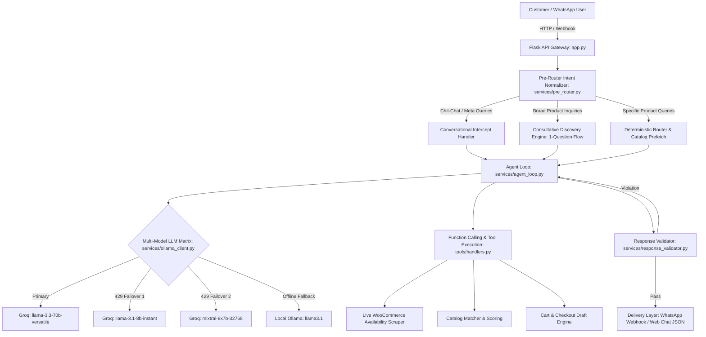

# 📘 Kepler Sales AI Assistant — Developer Documentation

> **System**: Kepler Tech WhatsApp & Web AI Sales Assistant  
> **Stack**: Python 3.11 · Flask · MongoDB / In-Memory JSON DB · Groq Multi-Model Matrix / Ollama · Meta WhatsApp Cloud API · Edge TTS · WooCommerce Real-Time Scraper  
> **Version**: 2.4.0  

---

## 📑 Table of Contents
1. [Architecture Overview](#1-architecture-overview)
2. [Directory Structure](#2-directory-structure)
3. [Agent Execution Loop & Lifecycle](#3-agent-execution-loop--lifecycle)
4. [Multi-Model LLM Resilience Matrix](#4-multi-model-llm-resilience-matrix)
5. [Live Availability & Web Scraping Engine](#5-live-availability--web-scraping-engine)
6. [Pre-Router & Conversational Intercepts](#6-pre-router--conversational-intercepts)
7. [Response Safety & Anti-Hallucination Validator](#7-response-safety--anti-hallucination-validator)
8. [Database & Storage Layer](#8-database--storage-layer)
9. [REST API Reference](#9-rest-api-reference)
10. [Web Embedding & Widget Integration](#10-web-embedding--widget-integration)
11. [Testing & Quality Assurance](#11-testing--quality-assurance)
12. [Environment Configuration & Deployment](#12-environment-configuration--deployment)

---

## 1. Architecture Overview



---

## 2. Directory Structure

```text
salesai/
├── app.py                         # Main Flask application & route controllers
├── config.py                      # Environment configuration
├── db.json                        # Development local persistent storage
├── products.json                  # 801 genuine Kepler catalog items
├── requirements.txt               # Python package dependencies
│
├── models/                        # Data access layer (MongoDB / in-memory JSON)
│   ├── db.py                      # Shared database manager with automatic fallback
│   ├── product.py                 # Product search, indexing, and scoring
│   ├── chat_session.py            # Conversation session transcript tracker
│   ├── cart.py                    # Multi-turn shopping cart manager
│   ├── lead.py                    # CRM lead lifecycle manager
│   └── order.py                   # Order generation and payment status
│
├── prompts/                       # LLM persona prompts
│   ├── persona.py                 # Kepler Sales Agent v2.4 core system prompt
│   └── discovery.py               # Consultative qualification question templates
│
├── services/                      # Core business logic services
│   ├── agent_loop.py              # Multi-turn ReAct reasoning loop
│   ├── pre_router.py              # Input typo cleaner & conversational interceptor
│   ├── discovery_engine.py        # 1-question consultative discovery
│   ├── response_validator.py      # Anti-hallucination & safety validator
│   ├── ollama_client.py           # Multi-model Groq/Ollama LLM client
│   ├── kepler_api.py              # ERPNext integration (leads/quotes)
│   ├── whatsapp.py                # Meta Cloud API & Edge TTS voice generator
│   ├── lead_extraction.py         # Autonomous CRM attribute extraction
│   └── rendering.py               # Invoice & receipt HTML card renderer
│
├── tools/                         # Function calling definitions & handlers
│   ├── definitions.py             # OpenAI-compatible function schema definitions
│   └── handlers.py                # Tool execution logic & live web scraper
│
├── static/                        # Frontend UI assets
│   ├── css/
│   │   ├── style.css              # Main dark/light theme styles
│   │   └── widget.css             # Embeddable launcher and pop-up frame styles
│   └── js/
│       ├── app.js                 # Customer chat client (audio waveform, cards, lightbox)
│       ├── admin.js               # CRM WhatsApp Studio & live transcript monitor
│       └── kepler-widget.js       # Auto-injecting embeddable widget loader
│
├── templates/                     # Jinja2 HTML templates
│   ├── index.html                 # Main chat client & embedded widget view
│   ├── admin.html                 # Enterprise CRM & WhatsApp Studio
│   ├── widget_demo.html           # Storefront integration testbed (/widget-demo)
│   └── checkout.html              # Customer order payment gateway
│
└── tests/                         # Automated test suite (55 pytest unit tests)
    ├── test_advanced_routing.py
    ├── test_agent_loop.py
    ├── test_app_routes.py
    ├── test_conversation_intelligence.py
    ├── test_discovery_engine.py
    ├── test_lead_extraction.py
    ├── test_response_validator.py
    ├── test_sales_question_categories.py
    ├── test_stress_and_hallucinations.py
    └── test_tools.py
```

---

## 3. Agent Execution Loop & Lifecycle

The agent loop (`services/agent_loop.py:process_chat_message`) follows an event-driven flow:

1. **Language Detection & Input Normalization**:
   - The user message is translated to English for internal reasoning.
   - Typographical and phonetic artifacts (e.g. `epsn` ➔ `epson`, `compnay ocated` ➔ `company located`) are normalized.
2. **Conversational & Chit-Chat Intercept**:
   - Meta questions regarding agent identity, feelings, company headquarters (Dubai Al Maktoum Tower), and volume discount policies (10% on 5+ pcs) are answered directly without catalog search delays.
3. **Deterministic Search Prefetch**:
   - If the user specifies a hardware model (e.g. `SC-P9500` or `CX-02`), live catalog context is prefetched and inserted into the prompt.
4. **ReAct Reasoning & Function Execution**:
   - The agent invokes tools (`search_products`, `check_stock`, `get_price`, `add_to_cart`, `generate_payment_link`).
5. **Safety Validation**:
   - The generated response is passed through `services/response_validator.py` before final output formatting.

---

## 4. Multi-Model LLM Resilience Matrix

To protect against token-per-minute (TPM) or token-per-day (TPD) rate limit exhaustion on free/on-demand tiers, `services/ollama_client.py` uses an automated multi-model failover ladder:

| Priority | Model Identifier | Provider | Latency | Role |
|:---|:---|:---|:---|:---|
| **Tier 1 (Primary)** | `llama-3.3-70b-versatile` | Groq Cloud | ~280ms | Deep consultative reasoning & complex tool calls |
| **Tier 2 (Fallback 1)** | `llama-3.1-8b-instant` | Groq Cloud | ~120ms | Ultra-fast tool calling and conversational responses |
| **Tier 3 (Fallback 2)** | `mixtral-8x7b-32768` | Groq Cloud | ~350ms | High-context fallback |
| **Tier 4 (Offline)** | `llama3.1:latest` | Local Ollama | Local HW | 100% offline fallback when no internet/API key |

---

## 5. Live Availability & Web Scraping Engine

Availability verification in `tools/handlers.py:fetch_live_website_stock` connects the AI directly to the live WooCommerce status on **keplertechllc.com**:

- **In-Stock Output**: Returns live stock badge with verified checkout price in AED.
- **Out-of-Stock Output**: Proactively discovers and suggests up to 2 **in-stock alternatives** within the same category.

---

## 6. Pre-Router & Conversational Intercepts

`services/pre_router.py` prevents conversational and meta queries from triggering awkward product search errors:

- **Identity**: Identifies as *Kepler Sales Agent* at *Kepler Tech LLC*.
- **Location**: Cites Dubai Headquarters (Al Maktoum Tower, Dubai) with delivery across all UAE Emirates and GCC.
- **Discounts**: Details the **10% automatic volume discount on 5+ pcs** and custom corporate packages.
- **Session Memory**: Explains active session tracking for order drafting.

---

## 7. Response Safety & Anti-Hallucination Validator

`services/response_validator.py` enforces multi-layer output validation:

1. **Anti-Leak Filter**: Blocks unparsed raw JSON blobs (`{"name": "search_products"...}`) and internal database keywords (`db.json`, `collection.find`, `mongo_uri`).
2. **Competitor Firewall**: Blocks mentions of unauthorized competitors (e.g. *Canon, Roland, Shutterfly*).
3. **Price Sanity Bounds**: Rejects hallucinatory 0 AED claims or hardware prices outside authorized boundaries.
4. **Self-Correction Retry Loop**: In case of a violation, automatically retries the agent loop with corrective guidance.

---

## 8. Database & Storage Layer

`models/db.py` provides transparent persistence:

- **Production Mode**: MongoDB replica sets with indexes on `session_id`, `created_at`, and `sku`.
- **Local Dev / Demo Fallback**: Thread-safe in-memory dictionary saved atomically to `db.json` on write operations.

---

## 9. REST API Reference

### Chat & Client Endpoints
- **`POST /api/chat`**: Process customer message.
  - *Payload*: `{"session_id": "...", "message": "...", "language": "English", "voice_reply": false}`
  - *Response*: `{"bubbles": [{"sender": "bot", "text": "...", "audio_url": null}]}`
- **`GET /api/chat/<session_id>`**: Retrieve complete session transcript.
- **`GET /api/products`**: Fetch full product catalog with live stock status.
- **`GET /api/lead/<session_id>`**: Get CRM lead profile for active session.

### Admin & CRM Studio Endpoints
- **`GET /api/admin/chats`**: List all active customer sessions with intent badges.
- **`POST /api/admin/chats/<session_id>/send`**: Send human agent takeover text message.
- **`POST /api/admin/chats/<session_id>/voice`**: Synthesize and dispatch Neural Voice Note.
- **`GET /api/admin/analytics`**: Pipeline conversion stats and revenue analytics.

### Webhook & WhatsApp Gateway
- **`GET /webhook`**: Meta WhatsApp verification handshake.
- **`POST /webhook`**: Inbound WhatsApp text and voice note processor.

---

## 10. Web Embedding & Widget Integration

To embed the Kepler Sales Agent on **keplertechllc.com** or any external site:

### Standard Script Integration:
Add this single script tag before `</body>`:
```html
<script src="http://127.0.0.1:5000/static/js/kepler-widget.js" async defer></script>
```

### Iframe Embed URL:
Load the lightweight responsive interface directly:
```html
<iframe src="http://127.0.0.1:5000/?embed=1" width="400" height="600" frameborder="0"></iframe>
```

---

## 11. Testing & Quality Assurance

Run the complete 55-test automated test suite using `pytest`:

```powershell
.\venv\Scripts\pytest tests/ -v
```

---

## 12. Environment Configuration & Deployment

### Environment Variables (`.env`)

```ini
# Flask Core
PORT=5000
DEBUG=False

# Database
MONGO_URI=mongodb://localhost:27017/
DB_NAME=sales_ai

# LLM Configuration
LLM_PROVIDER=groq
GROQ_API_KEY=gsk_your_groq_api_key_here
GROQ_MODEL=llama-3.3-70b-versatile
AGENT_MAX_LOOPS=6

# Local Ollama Fallback
OLLAMA_API_URL=http://localhost:11434
OLLAMA_MODEL=llama3.1:latest

# Admin Security
ADMIN_API_KEY=your_secure_admin_key_here

# Meta WhatsApp Cloud API (Optional for WhatsApp live gateway)
WHATSAPP_TOKEN=your_meta_token_here
WHATSAPP_PHONE_NUMBER_ID=your_phone_number_id_here
WHATSAPP_VERIFY_TOKEN=your_verification_token_here
```

### Running Locally:
```powershell
# Activate Virtual Environment
.\venv\Scripts\Activate.ps1

# Run Application Server
python app.py
```
