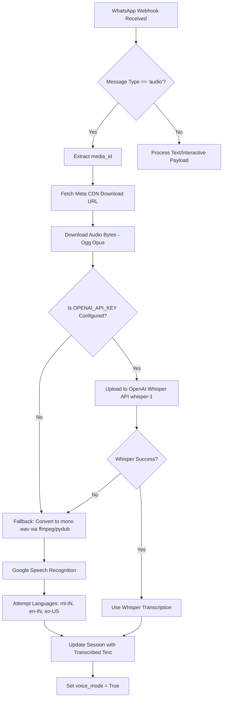
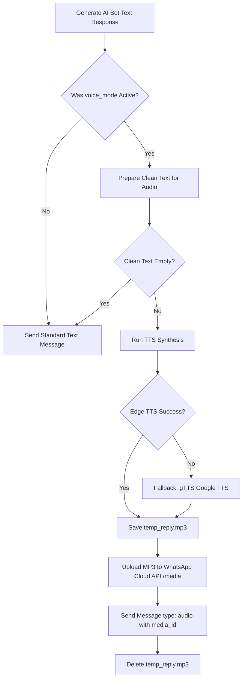

# Voice Processing System Documentation

This document provides a detailed overview of the Speech-to-Text (STT) and Text-to-Speech (TTS) pipelines integrated into the SalesAI WhatsApp application.

---

## 1. Inbound Voice Notes: Speech-to-Text (STT)

When a customer sends a voice note on WhatsApp, the application automatically intercepts and transcribes the audio so the bot can process it as text.



### Inbound Code Reference
* **Entry point:** [app.py](file:///c:/Users/DELL/Desktop/salesai/app.py) handles the incoming webhook payload.
* **Audio downloading & transcription logic:** Located in the [transcribe_audio_via_whisper()](file:///c:/Users/DELL/Desktop/salesai/services/whatsapp.py#L175-L271) function.

### Fallback Mechanism
1. **Primary Engine:** OpenAI Whisper API (`whisper-1`) — directly accepts `.ogg` files and transcribes them.
2. **Secondary Fallback:** Google Speech Recognition (free, no API key). Converts `.ogg` to mono `.wav` (16kHz) dynamically using `ffmpeg` (or `pydub`), then attempts recognition in Malayalam (`ml-IN`), Indian English (`en-IN`), and US English (`en-US`).

---

## 2. Outbound Voice Replies: Text-to-Speech (TTS)

When a customer initiates contact with a voice note, the application flags `voice_mode = True`, instructing the chatbot to reply with a synthesized audio message.



### Text Normalization / Clean Up
Before passing text to the TTS engines, it is cleaned in [_prepare_voice_text()](file:///c:/Users/DELL/Desktop/salesai/services/whatsapp.py#L304-L346):
* Emojis, markdown formatting (`*`, `_`, `` ` ``), bullet points, and URL links are removed.
* Internal product/card IDs are filtered out so they are not read aloud.
* Currency signs are expanded (e.g., `AED 100` becomes `100 dirhams`).
* Micro-pauses (punctuation ellipses `...`) are added after filler terms like `"got it"` or `"sure thing"`.

---

## 3. Voice Configuration (Male & Female Persona)

The application utilizes **Microsoft Edge Neural TTS** which offers natural prosody and voice selection.

### Available Voices
These are defined in [send_whatsapp_voice()](file:///c:/Users/DELL/Desktop/salesai/services/whatsapp.py#L349-L356):

* **Male Voice (Jishan Persona):** `en-US-AndrewNeural` (Fallback: `en-US-GuyNeural`)
  * Characterized by a warm, professional, friendly voice tone.
  * Paced slightly slower (`rate="-6%"`) and pitched warm (`pitch="+2Hz"`).
* **Female Voice:** `en-US-AriaNeural`
  * A conversational, highly natural female voice model.

### Changing the Active Voice
By default, the voice parameter uses the Male voice:
```python
def send_whatsapp_voice(to_number: str, text: str, voice: str = "en-US-AndrewNeural")
```

To configure or change the default voice (e.g. to switch to the Female voice), update the parameter where it is called in [app.py](file:///c:/Users/DELL/Desktop/salesai/app.py):

* **Auto-Replies in Webhook Route:**
  ```python
  # In app.py - change to use the female voice
  send_whatsapp_voice(sender, first_bubble, voice="en-US-AriaNeural")
  ```
* **Manual Admin Console Voice Notes:**
  ```python
  # In app.py - change to use the female voice
  send_whatsapp_voice(session_id, text, voice="en-US-AriaNeural")
  ```

---

## 4. Dependencies
The voice system uses the following library dependencies (defined in [requirements.txt](file:///c:/Users/DELL/Desktop/salesai/requirements.txt)):
* `edge-tts`: Communicates with Microsoft's Edge Speech Synthesis servers.
* `SpeechRecognition` / `gTTS`: Used for fallback transcription and synthesis respectively.
* `ffmpeg` / `static-ffmpeg`: Used to transcode audio files on the fly.
